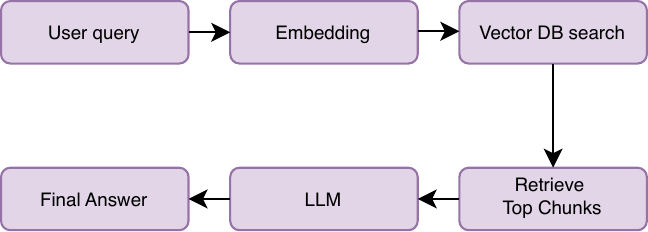
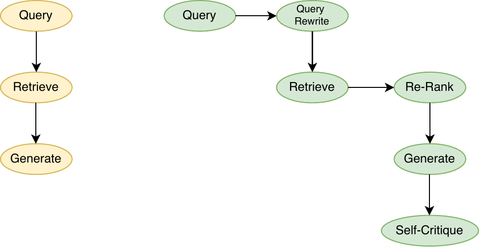
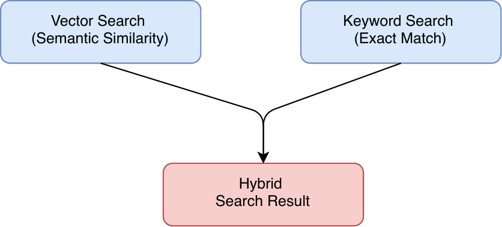

Abstract

This paper presents a comprehensive examination of Retrieval-Augmented
Generation (RAG) as a production-deployable AI capability for the Test
and Evaluation (T&E) programs of Government Departments, illustrated by
the Department of War (DoW). The paper is organized around four core
arguments:

> \(1\) RAG architecturally outperforms general-purpose Large Language
> Models (LLMs) for domain-specific T&E tasks by grounding inference in
> authoritative, mission-curated knowledge bases rather than relying
> solely on parametric memory;
>
> \(2\) production RAG systems require a specific, layered architecture
> spanning document ingestion, vector indexing, retrieval orchestration,
> generation, and observability, deployable across cloud impact levels;
>
> \(3\) operating RAG with Controlled Unclassified Information (CUI) and
> classified data requires a security control regime drawn from NIST SP
> 800-53, the DoD Risk Management Framework (RMF), CMMC, Zero Trust
> Architecture (ZTA) principles, and DISA impact-level guidance; and
>
> \(4\) few-shot prompting transforms a RAG question-answering pipeline
> into a structured, automated report generation capability that
> materially reduces analyst workload and accelerates T&E deliverables
> such as Test Plans, Test Reports, and Interim Fielding Assessments.

Together, these arguments establish the theoretical and practical
foundation for a full-lifecycle RAG deployment within a T&E enterprise.
We ground the discussion in a case study of a production RAG system the
authors deployed on Amazon Web Services (AWS) *GovCloud* for a Navy
warfare center, providing concrete evidence of the layered architecture
in operational use.

**Keywords:** Retrieval-Augmented Generation, Large Language Models,
Test and Evaluation, Few-Shot Prompting, Cloud Security

# Introduction

Large Language Models (LLMs) have emerged as transformative tools across
governments and industry, yet their application to Test and Evaluation
programs presents acute challenges. LLMs store knowledge in fixed model
weights trained on a static corpus; once training ends, the model cannot
access updated information without retraining (Lewis et al. 2020; Gao et
al. 2023). For T&E environments, this creates three critical failure
modes:

- knowledge staleness, as test procedures, system specifications, and
  standards evolve continuously;

- hallucination under domain sparsity, where models generate plausible
  but factually incorrect outputs in safety and mission-critical
  reporting contexts; and

- poor traceability, where outputs cannot be traced to specific
  authoritative sources, likely violating departmental documentation
  standards that require cited, auditable evidence.

Retrieval-Augmented Generation (RAG), first formally introduced by Lewis
et al. (2020) at Facebook AI Research, addresses these limitations by
combining pre-trained parametric memory (the LLM) with non-parametric
memory (a dense vector index of documents) accessed through a
pre-trained neural retriever. The original formulation proposed two
architectures:

- RAG-Sequence, where the same retrieved document conditions the entire
  generated sequence, and

- RAG-Token, where different documents can inform different output
  tokens.

Both approaches achieved state-of-the-art results on open-domain
question answering, outperforming both parametric-only and extractive
retrieval-based approaches (Lewis et al. 2020). RAG has since become the
dominant approach for knowledge-grounding LLMs in enterprise and
government contexts (Kaddour et al., 2023; Karakurt & Akbulut, 2026).
Advantages claimed include:

- enabling dynamic knowledge updates without retraining,

- source attribution that better satisfies Government traceability
  requirements,

- cost-efficient knowledge base maintenance,

- substantial reduction in hallucination (Gao et al. 2023), and

- regulatory alignment through classification-aware metadata (Amazon Web
  Services 2025; IBM 2025).

U.S. Defense Cloud Impact Levels (IL4--IL6) define progressively
stricter security environments for handling defense data, ranging from
Controlled Unclassified Information (CUI) at IL4, through sensitive
mission-critical unclassified systems at IL5, to classified SECRET
workloads at IL6. These levels dictate the required controls for data
storage, access, and processing, and shape how RAG systems must be
architected and deployed across unclassified and classified
environments.

The DoW has recently signaled that RAG is not merely a research interest
but an operational mandate. In January 2026, the Department of the Navy
(DoN) formally designated its main provider of RAG, *GenAI.mil,* as the
mandated CUI and IL5 generative AI platform for all its users. All DoN
organizations and commands are to transition no later than April 30,
2026 (Department of the Navy 2026). This enterprise-level mandate,
issued jointly by the Assistant Secretary of the Navy for Research,
Development, and Acquisition and the DON Chief Information Officer,
confirms that RAG-enabled AI for sourcing answers from uploaded
documents, secure web grounding, and deep research capabilities is now
an institutional requirement rather than an optional capability.

This paper presents a comprehensive examination of RAG as a
production-deployable capability for T&E programs. We argue that RAG
architecturally outperforms general-purpose LLMs for domain-specific T&E
tasks and that production deployment for T&E requires a specific layered
architecture deployable across cloud impact levels IL4 through IL6.
Further, our research found that operating with CUI and classified data
demands a rigorous security control regime, and that few-shot prompting
transforms RAG from a question-answering tool into a structured
automated T&E report generation capability. We illustrate these
arguments with a case study of a production deployment that the authors
built on AWS GovCloud for a Navy warfare center. Together, these
arguments establish the foundation for full-lifecycle RAG deployment
within a departmental T&E enterprise.

Our case study also examined the "NIPRNet" and "SIPRNet" for the
unclassified and secret government networks, "Authorization to Operate
(ATO)" for system accreditation, "CMMC" for supplier cyber-maturity
certification, and "CDAO" for the central defense AI office. Equivalent
constructs exist in most allied defence establishments and in many
regulated civilian sectors like health, finance, and critical
infrastructure. Where a DoW-specific term first appears, we have tried
to expand the acronym and (where useful) note the generic concept it
instantiates so readers in other ministries, agencies, or industries can
map the discussion onto their own equivalents.

# How RAG works and why it outperforms general-purpose LLMs for T&E

## Fundamental Limitations of Parametric-Only LLMs

Fine-tuning refers to retraining a pre-trained language model on
task-specific data so that domain knowledge is internalized within the
model's parameters and performance improves on downstream tasks (Lewis
et al. 2020; Gao et al., 2023; IBM 2025). Fine-tuning as an alternative
to RAG incurs high retraining compute costs, degrades performance on
tasks outside the fine-tuned domain, and still cannot access information
created after training (Kirkpatrick et al. 2017; Stack Overflow 2023;
F22 Labs 2024). In T&E contexts, where test procedures, system
specifications, and military standards evolve continuously, a static LLM
cannot track updates without costly fine-tuning cycles. When a model
lacks sufficient domain-specific training data, it generates
plausible-sounding but factually incorrect outputs (Gao et al. 2023): a
critical risk in safety and mission-critical T&E reporting.

## The RAG Paradigm: Architecture and Mechanism

The core RAG pipeline consists of four stages
(Figure [1](#fig:rag-pipeline)). First, document ingestion and
preprocessing, where raw T&E artifacts such as test plans, test reports,
specifications, concepts of operation and standards are parsed,
normalized, and segmented into chunks. Second, embedding and indexing,
where each chunk is encoded into a dense vector representation by an
embedding model and stored in a vector database alongside metadata like
document title, classification marking, date, and system identifier. The
key insight is that embeddings encode semantic meaning, not keywords,
whereby sentences with entirely different words but similar meaning
(e.g., "the dog chased the ball" and "a puppy ran after a sphere") are
mapped to nearby points in vector space (Reimers & Gurevych, 2019),
enabling semantic retrieval that keyword search cannot achieve. Third,
query-time retrieval, where a user submits a query, the query is
embedded using the same embedding model, and cosine similarity or
approximate nearest-neighbor search retrieves the top-$k$ most relevant
chunks from the vector store. Fourth, augmented generation, where
retrieved chunks are injected into the LLM's context window as grounding
evidence, and the LLM synthesizes a response anchored to that evidence
rather than relying solely on parametric memory (Amazon Web Services
2025; IBM 2025).

[]{#fig:rag-pipeline
.anchor}{width="3.2562806211723534in"
height="1.16582895888014in"}

Figure 1: Core RAG pipeline showing the query-time retrieval flow (top)
and document ingestion path (bottom). The embedding model creates dense
vector representations that enable semantic matching between queries and
document chunks.

The chunking strategy critically affects retrieval quality (Wang et al.,
2024). Chunks that are too small fragment context and lose coherence,
while chunks that are too large waste the LLM's context window and
dilute focus. Wang et al. (2024) conducted systematic experiments
comparing chunk sizes of 128, 256, 512, 1024, and 2048 tokens, finding
that 512-token chunks achieved the highest average faithfulness score
(97.59%) while 256-token chunks achieved the highest relevancy (97.78%),
with both substantially outperforming the 2048-token baseline (80.37%
faithfulness, 91.11% relevancy). Among chunking techniques, the sliding
window approach, which uses overlapping chunks to prevent boundary
information loss, outperformed both original chunking and the
small-to-big method, achieving 97.41% faithfulness and 96.85% relevancy
(Wang et al. 2024). Therefore, semantic-boundary chunking at paragraph
or section boundaries is preferred over fixed-token chunking for
structured T&E documents.

RAG implementations have evolved through several generations
(Figure [2](#fig:naive-vs-advanced)) as outlined by Gao et al. (2023).
Naive RAG performs simple single-pass retrieve-then-generate operations
but is prone to low-precision retrieval and context misalignment.
Advanced RAG incorporates pre-retrieval query expansion, re-ranking,
post-retrieval compression, and relevance filtering to improve chunk
quality (Gao et al. 2023; *Promptingguide.ai* 2024b). Re-ranking, where
deep language models are used to re-score retrieved chunks by relevance,
can dramatically improve retrieval precision. For example, Wang et al.
(2024) report that on the Microsoft MAchine Reading Comprehension (MS
MARCO) passage ranking benchmark, LLM-based re-rankers such as
*RankLLaMA* substantially outperform lexical baselines. Specifically,
*RankLLaMA* achieves an MRR@10 of approximately 22.1%, compared to 6.5%
for Best Matching 25 (BM25), representing a 3.4-fold improvement.
Similarly, Hit@10 increases from 24.6% to 54.5%.

Modular RAG introduces composable pipeline nodes, including specialized
retrievers, memory modules, adaptive retrieval triggers, and iterative
retrieval for complex multi-hop queries. Agentic RAG represents the
emerging frontier, where an LLM orchestrator autonomously decides when
retrieval is needed, formulates sub-queries, and integrates multiple
retrieval rounds Singh et al. (2025). Agentic RAG patterns are already
appearing in Chief Digital and Artificial Intelligence Office (CDAO) AI
Rapid Capabilities Cell pilots (GDIT 2024).

[]{#fig:naive-vs-advanced
.anchor}{width="4.91457239720035in"
height="2.5276377952755906in"}

Figure 2: Naive RAG versus Advanced RAG. Naive RAG performs a single
retrieve-then-generate pass. Advanced RAG adds query rewriting,
re-ranking, and self-critique stages that substantially improve accuracy
for production deployments.

Three common failure modes must be addressed in production RAG systems.
First, retrieval can miss relevant chunks, usually mitigated through
better chunking strategies, query rewriting, higher $k$ values, and
re-ranking. Second, the model can ignore good context, usually mitigated
through explicit prompt instructions such as "Answer ONLY from provided
context; if the information is not there, say so." Third, hallucinations
can persist despite retrieved context, usually mitigated by requiring
the model to quote source passages before generating answers, forcing
citation-grounded output.

## Why RAG Dominates Fine-Tuning for T&E Domains

RAG offers decisive advantages over fine-tuning for T&E applications.
RAG knowledge bases can be updated asynchronously, such as new test
results or updated specifications, without retraining the LLM, whereas
fine-tuned models require full retraining cycles (Stack Overflow 2023;
IBM 2025). RAG returns the retrieved document chunks alongside the
generated answer, enabling analysts to verify outputs against primary
sources and satisfying DoW documentation traceability requirements
(Amazon Web Services 2025). Updating a vector index is orders of
magnitude cheaper than re-running a fine-tuning run on GPU clusters (F22
Labs 2024; Shao et al., 2023). Studies show accuracy and usefulness
improvements of 107% to 177% on domain question-answering tasks when RAG
is applied versus zero-shot LLM baselines (Dayarathne et al., 2025).
Retrieved documents carry classification markings and provenance
metadata, enabling access-controlled generation consistent with
compartmentalized security handling requirements.

In the simplest mental model, RAG combines its metaphorical 'librarian'
with a language model. The 'librarian' searches the knowledge base and
hands over relevant pages, then the model reads those pages and writes
the answer. Most RAG failures trace to one of two causes: the wrong
documents were retrieved, or the model failed to use the documents it
was given. This framing clarifies that RAG quality depends as much on
retrieval engineering as on the generative model.

It is important to note that RAG is not always universally appropriate.
When the entire knowledge base fits within a single LLM context window,
direct context injection, colloquially known as "stuffing", is simpler
and avoids retrieval latency. When the task requires holistic reasoning
over an entire corpus rather than targeted retrieval, RAG's chunk-based
approach may fragment necessary context. When latency is critical, and
retrieval adds unacceptable delay, or when the underlying data changes
every few seconds faster than embeddings can be refreshed, an
alternative architecture may be preferred. For deeply internalized,
static domain knowledge, fine-tuning remains appropriate, as
domain-adapted models consistently outperform general-purpose models on
tasks within that domain (Anisuzzaman et al., 2024). T&E applications,
however, are characterized by large, evolving document corpora and
strict traceability requirements (Kurzhals et al., 2025); precisely the
conditions where RAG excels.

## T&E-Specific Advantages

T&E knowledge bases include standards, test procedures, previous test
reports, systems engineering documents, specification trees, and
operator manuals. These bases are all ideal RAG corpus material. RAG can
retrieve and synthesize across hundreds of T&E artifacts simultaneously,
a task no single analyst can perform manually, certainly at scale. The
knowledge base ingestion pipeline can be triggered on a regular schedule
to capture new test data as it is generated, keeping the system current
with ongoing test programs. Because retrieved context is logged
alongside the generated answer, each output can be reproduced and
audited, an essential criterion for test record integrity.

## Quantitative Performance Benchmarks

Saad-Falcon et al. (2024) evaluate frameworks for assessing RAG,
including one known as the Retrieval Augmented Generation Assessment
(RAGAS). The framework evaluates RAG systems on context relevance,
answer faithfulness, and answer relevance, outperforming hand-written
heuristic baselines. Karakurt and Akbulut (2026) report that enterprise
RAG implementations are dominated by standard retrieval frameworks such
as FAISS and Elasticsearch, with GPT-based models comprising the
majority of deployed systems. Their systematic review further indicates
that domain-specific corpora significantly improve performance in
knowledge-intensive tasks, consistent with evidence from retrieval
benchmarks such as Benchmarking Information Retrieval (BEIR) (Thakur et
al. 2021), which highlight the importance of robust cross-domain
retrieval. Readers seeking a more comprehensive treatment of the broader
RAG evaluation landscape are referred to the recent PRISMA-aligned
systematic review of Brown et al. (2025), which catalogues the field's
evolution from Dense Passage Retrieval (DPR)-based baselines toward
modular, policy-driven architectures with hybrid retrieval and
uncertainty-aware control, and to Yu et al. (2025), who propose a
unified evaluation framework distinguishing retrieval, generation, and
end-to-end metrics.

# Architecture and technology stack for production DoW RAG deployment

A production DoW RAG system is not a single application but a
multi-layer data and AI platform. Treating it as an ad hoc chatbot
feature is the primary cause of failed deployments (DEV Community 2025).
Recent surveys of the RAG stack synthesize academic and industrial
deployment experience into a unified taxonomy with explicit attention to
trust, alignment, and domain adaptation (Wampler et al., 2026),
mirroring the layered, policy-driven approach we adopt below. The
architecture comprises five production layers.

## Layer 1: Document Ingestion and Preprocessing

Source connectors interface with SharePoint on NIPRNet and SIPRNet, SIPR
file shares, PDFs, Word documents, technical data packages, and
structured databases. Content extraction employs Optical Character
Recognition (OCR) for scanned documents, table extraction, and image
captioning, with normalization to plain text or structured JavaScript
Object Notation (JSON). Metadata enrichment captures classification
marking, originating organization, system program, document type,
version, and date as filterable fields. Deduplication and version
control detect superseded documents to prevent stale context injection.

## Layer 2: Embedding and Indexing

Chunking strategy is critical, whereby semantic-boundary chunking at
paragraph and section boundaries is preferred over fixed-token chunking,
with typical chunk sizes of 256--1024 tokens depending on document
structure (IJONIS 2026). For cloud and NIPRNet environments, embedding
models such as *OpenAI text-embedding-3-large* and *Google
text-embedding-004* (Zhao et al., 2024) are available on *GenAI.mil*.
For air-gapped and SIPRNet environments, open-source models such as
*BGE-M3*, *multilingual-e5-large*, or *Nomic Embed* (Zhao et al., 2024)
can be deployed on self-hosted GPU nodes.

Vector databases suitable for IL5/IL6 environments include *Milvus*,
*Weaviate*, *Qdrant*, and *pgvector*. A systematic comparison of five
open-source vector databases against four key criteria of multiple index
types, billion-scale vector support, hybrid search, and cloud-native
deployment, found that *Milvus* was the only database satisfying all
four criteria, making it the most comprehensive solution for enterprise
RAG deployments (Wang et al. 2024; GigaSpaces 2025; ZenML 2025). Hybrid
search combining dense vector search with sparse BM25 keyword search
(Figure [3](#fig:hybrid-search)) consistently outperforms either method
alone on T&E terminology-heavy corpora. Pure vector search excels at
semantic matching but misses exact terminology; BM25 keyword search
captures precise terms but lacks semantic understanding. Systematic
experiments documented by Wang et al. (2024) demonstrate that hybrid
search, computed as $S_{h} = \alpha \cdot S_{s} + S_{d}$ where $S_{s}$
and $S_{d}$ are normalized sparse and dense retrieval scores
respectively, achieves optimal performance \[at $\alpha = 0.3$, yielding
mAP of 47.14 and nDCG@10 of 72.50 on TREC DL19\] substantially
outperforming either BM25 (mAP 30.13) or dense retrieval alone. This
makes hybrid search essential for mission-critical RAG deployments where
T&E-specific terminology such as standards designators, system
nomenclature, and test procedure identifiers must be matched exactly.

[]{#fig:hybrid-search
.anchor}{width="4.083333333333333in"
height="1.846291557305337in"}

Figure 3: Hybrid search architecture combining dense vector search
(semantic similarity) with sparse BM25 keyword search (exact match) for
improved retrieval quality.

## Layer 3: Retrieval Orchestration

A production retrieval orchestration layer implements multiple
processing stages. Wang et al. (2024) identifies this feature as
critical to RAG performance, especially query classification
(determining whether retrieval is necessary), retrieval itself,
reranking, document repacking, and summarization. Query analysis and
expansion techniques include:

- query rewriting;

- hypothetical document expansion (HyDE), which generates
  pseudo-documents from the query and retrieves based on their
  embeddings; and

- multi-query generation to improve recall.

Wang et al. (2024) found that combining HyDE with hybrid search achieved
the best retrieval performance across benchmarks. Also, cross-encoder
re-rankers improve precision post-retrieval, with the "sides" repacking
method, where the most relevant documents are placed at both the
beginning and end of the context window, achieving optimal generation
performance. Metadata filtering based on access controls ensures users
only retrieve documents at or below their classification and clearance
level. Retrieved chunks are de-duplicated, ordered by relevance, and
formatted into a structured context window prompt.

## Layer 4: LLM Generation

Model selection varies by classification level. At IL4 on NIPRNet,
options include *GPT-4o* via Azure Government and Gemini for Government
on *GenAI.mil*; Anthropic Claude was previously available under a DoD
contract but is no longer authorized following the supply chain risk
designation discussed below. At IL5 for sensitive CUI, *Ask Sage* on
Azure Government IL5 provides dedicated instances with the Federal Risk
and Authorization Management Program (FedRAMP). At IL6 on SIPRNet,
dedicated cloud enclaves on SIPRNet-connected infrastructure with
U.S.-citizen-only personnel are required (Ask Sage 2025a; GRSee
Consulting 2025).

Prompt engineering specifies output format, citation requirements,
classification handling instructions, and role definition. [Few-shot
examples demonstrating the target report format condition the model for
structured output]{.mark} [generation.]{.mark}

## Layer 5: Observability, CI/CD, and Governance

Every query, retrieved chunk set, and generated response is logged to an
immutable audit trail, mandatory for Authorization to Operate (ATO) and
Security Technical Implementation Guide (STIG) compliance (DoD CIO
2024). Monitoring tracks retrieval quality metrics (*nDCG*, Hit Rate),
generation quality metrics (faithfulness, relevance), latency, and cost.
AI Continuous Delivery / Continuous Deployment (CI/CD) encompasses
version-controlled prompt templates, chunking logic, embedding models,
and re-ranker configurations, with regression tests on representative
T&E queries before any pipeline update. Human-in-the-loop review is
mandatory where all generated T&E deliverables are flagged for analyst
review before distribution.

## DoW-Specific Deployment Topology

The Joint Warfighting Cloud Capability (JWCC), the DoW's enterprise
multi-vendor cloud contracting vehicle, provides four enterprise cloud
on-ramps: AWS, Microsoft Azure, Google Cloud, and Oracle. These onramps
enable RAG infrastructure deployment at IL2 through IL6 (DefenseScoop
2024). CDAO AI Rapid Capabilities Cell sandboxes, launched in January
2025, provide cloud-hosted development and test environments at multiple
impact levels for rapid prototyping.

Reference deployment architectures span multiple classification levels.
NIPRNet at IL4 employs multi-tenant cloud RAG with Common Access Card
(CAC) authenticated API gateway, Azure AD/Entra integration, and Federal
Information Processing Standards (FIPS) 140-2 encryption. NIPRNet
sensitive at IL5 requires a dedicated, physically isolated cloud enclave
with U.S.-citizen personnel and 421+ NIST 800-53 controls. SIPRNet at
IL6 requires SECRET enclaves connected to SIPRNet with active SECRET
clearances, TEMPEST-shielded data centers, and
disconnected-from-internet inference nodes. Tactical and denied,
degraded, intermittent, or limited (DDIL) edge environments can leverage
containerized RAG stacks deployable on forward operating bases, naval
vessels, or disconnected operational environments (Ask Sage 2025b).

## Real-World DoW RAG Deployments

*GenAI.mil*, launched in December 2025, provides Google Gemini with
multimodal RAG and web-grounded search to 3 million DoW employees, built
on Google Cloud with *Anthropic*, *OpenAI*, and *xAI* contracts each
valued up to \$200 million at the time of award (DefenseScoop 2025),
noting the Anthropic component was subsequently removed following the
February--March 2026 supply chain risk designation discussed below.
Multiple service-specific generative AI platforms have been developed
and fielded on NIPRNet at IL4 with CAC authentication, with some
reaching over 100,000 users within three months of launch (Van Roo
2025). Army, Combatant Command, and CDAO enterprise platforms each
incorporate RAG at varying classification levels, demonstrating broad
adoption across the DoW (Van Roo 2025; Ask Sage 2025a).

## Orchestration Frameworks

The IBM RAG Orchestration Guide (2024) covers different frameworks.
*LangChain* provides modular pipeline construction for chaining
retrieval, re-ranking, and generation steps, with integrations across
all major vector databases and LLM APIs. *LlamaIndex* is optimized for
performant retrieval with strong support for structured document
indexing, multi-document routing, and sub-question decomposition
(Paragon 2024). Haystack, originally developed by *deepset*, offers a
component-based pipeline architecture in which retrievers, embedders,
rankers, and generators are composed as connected nodes, with
first-class support for hybrid retrieval, prompt templating, and
pluggable LLM backends. These features make it well suited to
vendor-agnostic designs that must tolerate inference-endpoint
substitution. All three frameworks support FIPS-compliant configurations
and air-gapped deployment when combined with self-hosted models.

# Security controls for RAG systems handling CUI and classified data

## Regulatory and Policy Framework

DoD Instruction 8510.01 mandates the Risk Management Framework
(comparable to ISO/IEC 27001-based frameworks used elsewhere) for all
DoW IT; AI systems including RAG pipelines are subject to full RMF
authorization before operational deployment (DoD CIO 2024). NIST SP
800-53 Rev 5 provides the authoritative control catalog, requiring RAG
systems to implement controls from Access Control, Audit and
Accountability, System and Communications Protection, System and
Information Integrity, and Risk Assessment families. NIST SP 800-171 Rev
3 and Cybersecurity Maturity Model Certification (CMMC) Level 2--3 apply
to contractors processing CUI. As of November 2025, CMMC is in effect
for DoW contracts, and RAG systems storing CUI must meet CMMC Level 2
minimum (Wiley Law 2025).

The NIST AI Risk Management Framework 1.0 with its GOVERN, MAP, MEASURE,
and MANAGE functions, along with the Generative AI Profile (NIST AI
600-1), provides voluntary but strongly recommended guidance; CDAO's
Responsible AI Toolkit is built on these frameworks (NIST 2025). The DoD
Zero Trust Strategy and Execution Roadmap specify 152 ZT activities
across five phases; RAG systems must implement identity, device,
network, application, and data pillars (DoD CIO 2026). Executive Orders
13556 and 13526 govern marking, handling, and transmission rules
directly applicable to RAG knowledge base content.

## Data Security Controls for the RAG Knowledge Base

### Classification-Aware Ingestion.

Every document ingested must have its classification marking parsed and
stored as a vector metadata field. Automated classification recognition
using natural language processing (NLP) classifiers trained on DoW
marking conventions detects and enforces markings, rejecting malformed
or unclassified documents submitted to classified stores. Separate
vector indexes by classification level (UNCLASSIFIED, CUI, SECRET, & TOP
SECRET) must reside in logically or physically isolated index
namespaces.

### Access Control and Least Privilege.

Attribute-Based Access Control (ABAC) enforces query-time metadata
filters ensuring users only retrieve chunks at or below their clearance
and need-to-know, such that queries from IL4-cleared users cannot
traverse IL6 vector indexes. All DoW RAG endpoints must be gated by CAC
or Personal Identity Verification (PIV) authentication. Role-Based
Access Control (RBAC) provides differentiated permissions for query,
ingest, delete, and model configuration operations.

### Encryption Requirements.

Data at rest requires AES-256 encryption on all vector database storage
volumes with FIPS 140-2/140-3 validated cryptographic modules. Data in
transit requires Transport Security Layer (TLS) 1.2 minimum with TLS 1.3
preferred for all API calls between RAG components, and mutual TLS for
service-to-service communication. Embedding vector confidentiality must
be maintained through dedicated inference nodes and secure enclaves, as
embedding models can leak information via vector similarity attacks
(Carlini et al., 2021).

## AI-Specific Threats and Mitigations

Prompt injection and indirect prompt injection occur when adversarial
input in retrieved documents instructs the LLM to override system prompt
instructions. Mitigations include input sanitization at ingestion,
prompt shields, and output validation to detect instruction-following
anomalies (Microsoft 2026).

Knowledge base poisoning represents a particularly acute threat. Zou et
al. (2025) demonstrated with *PoisonedRAG* that injecting just five
malicious texts into a knowledge base containing 2.68 million documents
could achieve a 97% attack success rate, inducing the LLM to generate
attacker-chosen target answers for attacker-chosen target questions. The
attack exploits the knowledge database as a new attack surface,
formulating poisoning as an optimization problem that simultaneously
satisfies retrieval conditions (ensuring malicious texts are retrieved)
and generation conditions (ensuring the LLM produces the target answer).
Critically, existing defenses, including paraphrasing and
perplexity-based detection. proved insufficient against *PoisonedRAG*
(Zou et al. 2025). Mitigations must therefore be layered: document
provenance verification, integrity hashing of all ingested content,
access-controlled ingest pipelines, and periodic adversarial audits of
retrieval behavior.

Model inversion and embedding leakage are mitigated by restricting API
access to authorized users, maintaining audit logs on all embedding
queries, and prohibiting external embedding service calls for classified
data. Hallucination in safety-critical outputs is mitigated through
groundedness scoring, mandatory human-in-the-loop review for all T&E
deliverables, and citation requirements for every factual claim.

## Authorization to Operate and Continuous ATO

The DoD AI Cybersecurity RMF Tailoring Guide provides AI-specific RMF
tailoring, requiring authorizing officials to validate cybersecurity
evidence at each model lifecycle phase (DoD CIO 2024). RAG pipelines
must be embedded in DevSecOps platforms such as *Platform One*, with
container images scanned against Defense Information Systems Agency
(DISA) Security Technical Implementation Guides (STIGs) and automated
Static and Dynamic Automated Security Testing (SAST/DAST) in CI/CD
pipelines. The continuous ATO pathway enables provisional ATO to be
sustained without full re-authorization at each update through
continuous monitoring with automated control assessment. CMMC Level 3
applies to RAG systems handling acquisition-sensitive or weapons-system
CUI, requiring 24 enhanced controls from NIST SP 800-172 and Defense
Industrial Base Cybersecurity Assessment Center (DIBCAC) assessment
(Wiley Law 2025).

## Zero Trust Architecture Integration

The identity pillar requires every human and non-human identity to be
continuously verified with no implicit trust for in-network components.
The data pillar enforces classification-boundary enforcement through the
RAG query router per the Federal Zero Trust Data Security Guide (CISO
Council 2025). The device pillar permits only DoW-managed,
STIG-compliant endpoints to access RAG interfaces with continuous device
posture assessment. The network pillar mandates micro-segmented virtual
networks isolating the vector database, embedding service, and LLM
inference from each other, with east-west traffic logged and
anomaly-detected.

## Vendor Supply Chain Risk: The Anthropic Designation

The February--March 2026 Anthropic supply chain risk designation
provides a stark illustration of why vendor-independent RAG
architectures are not merely a best practice but an operational
necessity. In July 2025, Anthropic and the Pentagon entered a contract
making *Claude* the first frontier model approved for use on classified
networks, with the Pentagon agreeing to abide by Anthropic's acceptable
use policy (AUP) prohibiting use for mass domestic surveillance and
fully autonomous weapons systems (Frazee et al. 2026). When the Pentagon
subsequently sought to renegotiate those terms to allow unrestricted
military use "for all lawful purposes," Anthropic refused. On February
27, 2026, President Trump directed all federal agencies to cease using
Anthropic technology, and Defense Secretary Hegseth designated Anthropic
a supply chain risk. By March 5, 2026, the DoW formally issued the
designation, the General Services Administration (GSA) removed Anthropic
from *USAi.gov*, and Navy commands began removing *Claude* models from
their generative AI platforms (Frazee et al. 2026).

The legal mechanisms available to enforce this designation, including
Federal Acquisition Supply Chain Security Act (FASCSA) exclusion orders
under Federal Acquisition Regulation (FAR) 52.204-29 and 52.204-30,
DoD-specific authority under 10 U.S.C. § 3252, and potential suspension
and debarment, collectively impose significant obligations on
contractors. Under FASCSA, contractors must review *SAM.gov* at least
quarterly for new orders, conduct reasonable inquiries into their supply
chains, report covered use within three business days, and submit
mitigation plans within ten business days, with obligations flowing down
to subcontractors at all tiers (Frazee et al. 2026).

For RAG system architects, this event validates the multi-model,
multi-vendor approach advocated throughout this paper. Organizations
that had architected their RAG pipelines around a single LLM provider,
particularly Anthropic's *Claude*, faced immediate operational
disruption. By contrast, systems designed with abstraction layers
between the RAG orchestration logic and the LLM inference endpoint could
transition to alternative models (*GPT-4o*, *Gemini*, or open-source
alternatives) with minimal architectural changes. The *Haystack* and
*LangChain* frameworks described earlier in this paper facilitate
exactly this kind of vendor-agnostic design, where swapping the LLM
component requires changing a model identifier rather than rewriting the
pipeline. The lesson is clear: RAG architectures must treat the LLM as a
replaceable component behind a standardized interface, not as a
foundational dependency.

## CUI Compliance for Cloud-Based RAG Infrastructure

Deploying RAG systems that handle CUI on cloud infrastructure requires
careful attention to encryption, network isolation, and the shared
responsibility model. Using Amazon *Bedrock* as an illustrative example,
the service can be accessed either over the public internet via
HTTPS/TLS 1.2+ or through a Virtual Private Cloud (VPC) endpoint using
AWS *PrivateLink*. Both methods satisfy NIST 800-171 Rev 2 control
3.13.8, requiring cryptographic protection of CUI during transmission.
However, VPC endpoints provide stronger network isolation as a
defense-in-depth measure, keep traffic off the public internet, provide
network-level audit trails, and simplify the security narrative for CMMC
assessors.

For data at rest, *Bedrock* encrypts all data by default using AWS-owned
keys with FIPS 140-2 validated cryptographic modules. While NIST 800-171
does not specify key ownership, customer-managed Key Management Service
(KMS) keys are strongly recommended for CUI workloads because AWS-owned
keys cannot be audited via *CloudTrail*, creating gaps in key management
(control 3.13.10) and audit logging (control 3.3.1) controls. A CMMC
assessor could reasonably interpret "establish and manage cryptographic
keys" as requiring demonstrable key management. This operational
consideration extends to all supporting infrastructure: when
provisioning Simple Storage Service (S3) buckets for document storage,
Elastic Block Store (EBS) volumes for vector databases, and Elastic
Compute Cloud (EC2) instances for RAG pipeline components,
customer-managed KMS keys should be selected at creation time.
Infrastructure-as-Code using *Terraform* with code reviews that check
for proper KMS and VPC configuration before merging provides automated
compliance enforcement.

# Case study: RAG deployment on AWS GovCloud for naval engineering

The authors developed and deployed a production RAG system on AWS
*GovCloud* (us-gov-west-1) for a Navy warfare center, providing
domain-specific AI assistance for corrosion engineering analysis. This
implementation demonstrates the practical feasibility of the layered
architecture described in the preceding sections and illustrates
concrete design decisions required for DoW RAG deployments. The system
described here was deployed prior to the February--March 2026 Anthropic
supply chain risk designation discussed in the security controls section
above. That said, the modular architecture described below allows the
inference endpoint to be swapped to an alternative model without changes
to the surrounding pipeline, exactly the vendor-independence pattern
this paper advocates.

## Architecture and Technology Stack

The *RustyAI* system implements a four-tier architecture on AWS
*GovCloud* EC2 instances. The frontend tier runs a *Streamlit* web
application behind an *Nginx* reverse proxy configured with TLS 1.3,
strong *Diffie-Hellman* key exchange, and security headers including
*X-Frame-Options*, *X-Content-Type-Options*, and *X-XSS-Protection*.
These collectively provide encrypted, hardened access to the RAG
interface. The application tier hosts the RAG pipeline built on the
*Haystack* framework, which orchestrates the retrieval and generation
workflow. The data tier employs *Milvus* as the vector database,
deployed as a *Docker Compose* stack with separate containers for the
*Milvus* server, *etcd* for metadata management, and *MinIO* for object
storage, providing component isolation and enterprise-grade reliability.
The inference tier leverages Amazon *Bedrock* for both embedding
generation via Amazon *Titan* (*text-embedding-v2*) and LLM inference
via Anthropic *Claude* Sonnet 3.5.

The system supports two *Milvus* deployment modes to accommodate
different operational scales. *Milvus Lite* operates as a Python library
with a local database file, scaling to several million vectors on a
*t3.small* instance, suitable for prototyping and small user
populations. *Milvus Standalone* runs as a containerized service on a
*t3.xlarge* instance, scaling to 100 million vectors and supporting
concurrent multi-user workloads appropriate for enterprise deployment.

## Document Ingestion Pipeline

The document ingestion pipeline converts unstructured T&E artifacts into
vector representations through a multi-stage process. Raw documents,
such as PDFs, technical data packages, handbooks, and specifications,
are first processed by *Docling*, an open-source library that employs
Optical Character Recognition (OCR) and vision-language models to
convert unstructured documents into structured *Markdown*. This
conversion runs on GPU-accelerated EC2 instances (*g6.2xlarge* with
NVIDIA L4 GPUs), reducing processing time from approximately two hours
to twenty minutes for typical document batches. Converted *Markdown*
files are staged in S3 buckets organized by project, with separate
prefixes for unprocessed source documents and processed outputs.

The *Haystack* embedding pipeline then ingests the *Markdown* files
through four connected components: a *Markdown*-to-document converter, a
recursive document splitter that segments text at character boundaries
into 5,000-character chunks, an Amazon *Bedrock* document embedder that
generates dense vector representations using Amazon *Titan*, and a
document writer that stores the embedded chunks with metadata in
*Milvus*. This pipeline architecture enables complete corpus rebuilds
from the S3-staged *Markdown* files, providing resilience against
database corruption or migration requirements.

## RAG Pipeline and Prompt Engineering

The query-time RAG pipeline chains four *Haystack* components: a text
embedder that encodes the user query using the same Amazon *Titan*
model, an embedding retriever that performs approximate nearest-neighbor
search against the *Milvus* collection returning the top-5 most relevant
chunks, a chat prompt builder that assembles the system prompt,
retrieved context, and user query into a structured message, and a chat
generator that produces the response via Amazon *Bedrock Claude*.

The prompt architecture employs a two-level design. The system prompt
establishes the assistant's role and domain scope. The user prompt
template uses Extensible Markup Language (XML)-delimited sections to
structure the retrieved documents, detailed behavioral instructions
specifying citation requirements and response formatting, and the user's
query. This structured prompt design ensures that generated responses
cite specific sources from the knowledge base, present information with
appropriate technical depth, and acknowledge limitations when retrieved
context is insufficient, directly addressing the traceability and
auditability requirements essential for DoW documentation standards.

## Source Attribution and User Feedback

The application displays retrieved document file paths as references
alongside each generated response, enabling users to verify AI-generated
guidance against primary sources. This source attribution mechanism
directly satisfies the DoW documentation traceability requirements
discussed in the introduction. The system also implements a
thumbs-up/thumbs-down feedback mechanism that logs the user query,
generated response, and feedback rating to a persistent file, providing
data for continuous pipeline quality assessment and prompt engineering
refinement.

## Lessons Learned

Several practical lessons emerged from this deployment. First, GPU
acceleration for document ingestion is not optional at scale, where the
order-of-magnitude speedup from CPU to GPU processing determines whether
corpus updates can be completed within operationally acceptable windows.
Second, the choice between *Milvus Lite* and *Standalone* should be
driven by concurrent user count and corpus size rather than defaulting
to the full deployment, noting *Milvus Lite*'s simplicity reduces the
operational burden for smaller programs. Third, Identity and Access
Management (IAM) credential management for *Bedrock* access requires
careful attention in *GovCloud* environments where role-based implicit
credentials may behave unreliably, necessitating explicit IAM user
credentials with minimal *Bedrock* permissions. Fourth, *Nginx* reverse
proxy configuration with proper TLS and security headers is essential
even for internal deployments, as *GovCloud* environments may block
unencrypted traffic and non-standard ports. Finally, the *Haystack*
framework's modular component architecture proved valuable for iterative
development, allowing individual pipeline stages to be modified or
replaced without affecting the overall system: a practical demonstration
of the vendor independence principles advocated throughout this paper.

# Few-shot prompting transforms RAG into automated T&E report generation

## From QA Tool to Report Generator

The difference between a baseline RAG system that answers questions and
a few-shot-prompted RAG system that produces structured, formatted
deliverables is entirely in the prompt engineering layer, where the
retrieval and generation architecture is unchanged. This conceptual
shift has profound implications for T&E analyst workload and deliverable
cycle time.

## Few-Shot Prompting: Mechanism and Efficacy

Few-shot prompting provides 3--8 input/output demonstration pairs in the
system or user prompt, conditioning the LLM to produce outputs that
match the demonstrated format, style, and structure (Brown et al. 2020;
*Promptingguide.ai* 2024b). LLMs at sufficient scale exhibit emergent
in-context learning; that is, the ability to infer a task from examples
without gradient updates (Touvron et al. 2023). Few-shot prompts paired
with RAG context show substantially higher accuracy than zero-shot RAG
on structured output tasks. For example, medical phenotyping studies
demonstrate positive predictive value improvements of 15--25 percentage
points from zero-shot to few-shot configurations (Park et al. 2025). The
synergy is clear: retrieved context provides factual grounding while
few-shot examples specify format and reasoning style; together producing
outputs that are both factually correct and structurally compliant with
T&E report templates.

## Designing T&E-Specific Few-Shot Prompts

Example selection must prioritize representativeness, spanning multiple
system types, test phases (DT, OT, LFT&E), and outcome categories.
Format fidelity requires examples to exactly replicate the target report
schema, such as section headers, table formats, finding codes, and
citation style. A minimal sufficient set of 3--5 high-quality examples
typically outperforms 10+ lower-quality examples (Saad-Falcon et al.
2024; Liu et al., 2021). All few-shot examples must be at or below the
operational classification level.

The prompt architecture for report generation comprises four components:

- a system prompt defining role, output constraints, and
  chain-of-thought instruction;

- a few-shot block of 3--5 complete example report sections with
  annotated retrieved context;

- a query block containing the analyst's request; and

- the context window of top-$k$ retrieved chunks from the T&E knowledge
  base.

## T&E Report Types Amenable to Automated Generation

Test and Evaluation Master Plan sections with background, test
objectives, and resource requirements are templated sections populated
from program documents. Test Execution Reports and Test Incident Reports
contain structured findings with condition, deviation, severity, and
corrective action fields, ideal for few-shot templating. Interim
Fielding Assessments synthesize operational effectiveness and
suitability data from multiple test events, leveraging RAG's
multi-document synthesis capability. Deficiency Reports and Failure
Reporting, Analysis, and Corrective Action System (FRACAS) entries
follow condition/cause/corrective action structures amenable to RAG
retrieval from previous deficiency databases. Metrics dashboards,
including Measure of Performance and Measure of Effectiveness tables,
can be generated from raw test data through few-shot prompting.

## Analyst Workload Reduction and Cycle Time Acceleration

The rapid adoption of DoW generative AI platforms by over 100,000 users
for drafting, summarizing, and code generation validates broad demand
(GDIT 2024; Van Roo 2025). Ask Sage reports 95% savings on ATO
documentation generation, with CDAO Combatant Command teams using it for
RFPs and acquisition strategy documents (Ask Sage 2025a). RAG-powered
report generation in legal and regulatory domains reduces the initial
draft times by 60--80% (Noy & Zhang, 2023; Brynjolfsson et al., 2023);
comparable reductions are expected for T&E given similar document
complexity. Automated first-pass drafts enforce completeness,
consistency, and citation coverage, likely avoiding errors of omission
that commonly delay T&E reports. Practitioner accounts of
enterprise-scale RAG deployments report that the dominant performance
lever is often the structure and authoring conventions of the knowledge
base itself rather than retrieval or model tuning, and that a
"human-in-the-lead" evaluation loop is required for novel user questions
(Packowski et al. 2024). This finding is directly applicable to T&E
knowledge bases authored under documentation standards. The analyst role
shifts from document drafter to document reviewer, focusing attention on
technical accuracy, edge cases, and judgment calls rather than
boilerplate generation.

## Evaluation Framework for RAG-Powered T&E Report Quality

RAG assessment metrics, such as faithfulness, context relevance, and
answer relevance, all provide automated pipeline quality scoring before
analyst review (*Promptingguide.ai* 2024a). In particular, the Automated
RAG Evaluation System (ARES) framework uses few-shot-seeded LLM judges
to evaluate context relevance, answer faithfulness, and answer
relevance, validated against human preference annotations (Saad-Falcon
et al. 2024). T&E-specific metrics include citation coverage rate,
format compliance rate, and deficiency detection rate compared to
ground-truth test records. Red-team evaluation of prompt injection,
knowledge base poisoning, and hallucination under missing-data
conditions must precede operational deployment.

## Integration with CDAO T&E Frameworks

The CDAO T&E of AI Models Framework identifies six evaluation areas:
Performance, Testing Methods, Data, AI Models, Context, and
Documentation; all applicable to evaluating RAG-based report generation
systems (Domino Data Lab 2025). Operational T&E of AI-Enabled
Capabilities requires operational realism in evaluation, mandating
testing with operationally representative document corpora and realistic
analyst queries. The DT&E Guidebook imposes regression testing
requirements for ML systems, requiring RAG pipeline regression testing
on fixed evaluation sets at each software update (OSD DTE&A 2025).
CDAO's Test, Evaluation, Validation, and Verification (TEVV) framework
requires integrated lifecycle evidence for ATO (National Academies of
Sciences 2023).

# Conclusion and research agenda

RAG represents the highest-value, lowest-risk AI capability available to
DoW T&E programs today. It does not require retraining, does not demand
classified training data to be exported to a vendor, and can be deployed
incrementally, beginning with unclassified document corpora on NIPRNet
before scaling to CUI and SECRET levels. The combination of 'RAG with
few-shot prompting' creates an automated T&E report generation
capability that is achievable within the current DoW cloud
infrastructure, security frameworks, and AI governance policies.

## Key Research Gaps

No published benchmark compares embedding models on T&E-specific
corpora, including standards, test procedures, and DT&E reports. Formal
verification methods for RAG access-control enforcement at inference
time remain immature, and adversarial classification-bypass testing is
needed. Empirical studies on how T&E analysts develop appropriate
reliance on RAG-generated outputs are lacking; both over-reliance and
under-reliance degrade mission outcomes. CDAO frameworks provide
high-level TEVV guidance, but specific quantitative pass/fail criteria
for RAG system readiness reviews are not yet standardized.

## Recommended Next Steps

A pilot deployment should stand up a NIPRNet IL4 RAG knowledge base
against an unclassified T&E document corpus, instrumented with RAG
assessment metrics, and run a 90-day analyst evaluation consistent with
Chief Data and Artificial Intelligence Officer Artificial Intelligence
Responsible Capability Council (CDAO AI RCC) sprint methodology. A
security architecture review should engage CDAO and DISA to establish
classification-aware RAG data flows in advance of an IL5/IL6 ATO
package. A few-shot template library should be developed and validated
for the five highest-frequency T&E deliverable types, version-controlled
in a prompt management system. A dedicated red-team exercise should
evaluate the RAG pipeline for prompt injection, poisoning, and
exfiltration vulnerabilities before any operational deployment.

# Acknowledgments

The authors are deeply grateful for the visionary spirit at Naval
Surface Warfare Center, Port Hueneme Division (NSWC PHD), where, under
the auspices of the CTO, Alan Jaeger, and in collaboration with William
Emeny, we were able to test many of the ideas presented in this paper.
We also thank the Navy warfare center engineering staff who collaborated
on the corrosion-engineering RAG deployment that grounds the case study
presented here, and our colleagues at GBL Systems who contributed to the
architecture, security, and ingestion pipeline work. We are grateful to
the ITEA Journal editorial team and the anonymous reviewers whose
feedback materially improved this paper.

# References

Anisuzzaman, D. M., Jeffrey G. Malins, Paul A. Friedman, and Zachi I.
Attia. 2024. "Fine-Tuning Large Language Models for Specialized Use
Cases." Mayo Clinic Proceedings: Digital Health 3 (1): 100184.
<https://doi.org/10.1016/j.mcpdig.2024.11.005>

Amazon Web Services. 2025. "What Is Retrieval-Augmented Generation
(RAG)?" <https://aws.amazon.com/what-is/retrieval-augmented-generation>.

Ask Sage. 2025a. "Defense Industrial Base Platform."
<https://www.asksage.ai/who-we-serve/defense-industrial-base>.

Ask Sage. 2025b. "Defense Industrial Base Platform: Tactical Edge
Capability."
<https://www.asksage.ai/who-we-serve/defense-industrial-base>.

Brown, Andrew, Muhammad Roman, and Barry Devereux. 2025. "A Systematic
Literature Review of Retrieval-Augmented Generation: Techniques,
Metrics, and Challenges." *Big Data and Cognitive Computing* 9 (12):
320. <https://doi.org/10.3390/bdcc9120320>.

Brown, Tom, Benjamin Mann, Nick Ryder, et al. 2020. "Language Models Are
Few-Shot Learners." *Advances in Neural Information Processing Systems*
33. <https://arxiv.org/abs/2005.14165>.

Brynjolfsson, Erik, Danielle Li, and Lindsey R. Raymond. 2023.
"Generative AI at Work." *National Bureau of Economic Research Working
Paper*.
<https://www.nber.org/system/files/working_papers/w31161/w31161.pdf>

Carlini, Nicholas, Florian Tramer, Eric Wallace, Matthew Jagielski,
Ariel Herbert-Voss, Katherine Lee, Adam Roberts et al. \"Extracting
training data from large language models.\" In *30th USENIX security
symposium (USENIX Security 21)*, pp. 2633-2650. 2021.

CISO Council. 2025. "Federal Zero Trust Data Security Guide."
<https://resources.data.gov/assets/documents/Zero-Trust-DataSecurityGuide_RevisedMay2025_CIO.govVersion.pdf>.

Dayarathne, Ranul, Uvini Ranaweera, and Upeksha Ganegoda. 2025.
"Comparing the Performance of LLMs in RAG-Based Question-Answering: A
Case Study in Computer Science Literature." *arXiv Preprint
arXiv:2511.03261*. <https://arxiv.org/abs/2511.03261>.

DefenseScoop. 2024. "Joint Warfighting Cloud Capability Overview."

DefenseScoop. 2025. "DOD Initiates Large-Scale Rollout of Commercial AI
Models."
<https://defensescoop.com/2025/12/09/genai-mil-platform-dod-commercial-ai-models-agentic-tools-google-gemini>.

Department of the Navy. 2026. "Department of the Navy Enterprise
Information Technology Service Designation for GenAI.mil."

DEV Community. 2025. "Inside a Production RAG System: Architecture,
Stack, and Lessons Learned."
<https://dev.to/seasia_infotech_899dc2c59/inside-a-production-rag-system-architecture-stack-and-lessons-learned-28h7>.

DoD CIO. 2024. "DoD AI Cybersecurity Risk Management Tailoring Guide."
<https://dodcio.defense.gov/Portals/0/Documents/Library/AI-CybersecurityRMTailoringGuide.pdf>.

DoD CIO. 2026. "Zero Trust Implementation Guideline Primer."
<https://media.defense.gov/2026/Jan/08/2003852320/-1/-1/0/CTR_ZERO_TRUST_IMPLEMENTATION_GUIDELINE_PRIMER.PDF>.

Domino Data Lab. 2025. "Automating the CDAO AI Test and Evaluation
Framework."
<https://domino.ai/blog/domino-automates-the-cdao-ai-test-and-evaluation-framework>.

F22 Labs. 2024. "Fine-Tuning Vs. RAG: Choosing the Right Approach."

Frazee, J. Ryan, John Prairie, and Adam S. Hickey. 2026. "Pentagon
Designates Anthropic a Supply Chain Risk---What Government Contractors
Need to Know." *Mayer Brown Legal Update*.

Gao, Yunfan, Yun Xiong, Xinyu Gao, et al. 2023. "Retrieval-Augmented
Generation for Large Language Models: A Survey." *arXiv Preprint
arXiv:2312.10997*. <https://arxiv.org/abs/2312.10997>.

GDIT. 2024. "How Adaptive RAG Makes Generative AI More Reliable for
Defense Missions."
<https://www.gdit.com/perspectives/latest/how-adaptive-rag-makes-generative-ai-more-reliable-for-defense-missions>.

GigaSpaces. 2025. "The 6 Best Vector Database Solutions for RAG
Applications."
<https://www.gigaspaces.com/blog/best-vector-database-solutions-for-rag-applications>.

GRSee Consulting. 2025. "DoD Cloud Computing Security Requirements
Guide: Impact Levels."
<https://grsee.com/resources/fed-assess/dod-cloud-security-requirements-how-to-secure-cloud-adoption>.

IBM. 2025. "What Is Retrieval-Augmented Generation (RAG)?"
<https://www.ibm.com/think/topics/retrieval-augmented-generation>.

IBM, *"RAG Orchestration: A Guide to Watsonx & Open-Source Tools,"* IBM
Think Architectures, 2024.
<https://www.ibm.com/think/architectures/rag-cookbook/orchestration>

IJONIS. 2026. "RAG Systems for Enterprise: Build a RAG Pipeline Step by
Step." <https://ijonis.com/en/rag-systems-enterprise>.

Kaddour, Jean, Joshua Harris, Maximilian Mozes, Herbie Bradley, Roberta
Raileanu, and Robert McHardy. 2023. *"Challenges and Applications of
Large Language Models."* arXiv preprint arXiv:2307.10169.

Karakurt, Ehlullah, and Akhan Akbulut. 2026. "Retrieval-Augmented
Generation (RAG) and Large Language Models (LLMs) for Enterprise
Knowledge Management and Document Automation: A Systematic Literature
Review." *Applied Sciences* 16 (1): 368.
<https://doi.org/10.3390/app16010368>.

Kirkpatrick, James, et al. 2017. "Overcoming Catastrophic Forgetting in
Neural Networks." *Proceedings of the National Academy of Sciences* 114
(13): 3521--26.

Kurzhals, J. H., Colombi, J. M., Jacques, D. R., and Stern, J. L. 2025.
*"*Advancing DoD Test & Evaluation Through a System Profile*." ITEA
Journal of Test and Evaluation*, 46(4), Article 1003.

Lewis, Patrick, Ethan Perez, Aleksandra Piktus, et al. 2020.
"Retrieval-Augmented Generation for Knowledge-Intensive NLP Tasks."
*Advances in Neural Information Processing Systems* 33.
<https://arxiv.org/abs/2005.11401>.

Liu, J., Shen, D., Zhang, Y., Dolan, W. B., Carin, L., & Chen, W. (2022,
May). What makes good in-context examples for GPT-3?. In *Proceedings of
Deep Learning Inside Out (DeeLIO 2022): The 3rd workshop on knowledge
extraction and integration for deep learning architectures* (pp.
100-114).

Microsoft. 2026. "Architecting Trust: A NIST-Based Security Governance
Framework for AI Agents."
<https://techcommunity.microsoft.com/blog/microsoftdefendercloudblog/architecting-trust-a-nist-based-security-governance-framework-for-ai-agents/4490556>.

National Academies of Sciences. 2023. *Test and Evaluation Challenges in
AI-Enabled Systems for the Department of the Air Force*. National
Academies Press.
<https://www.nationalacademies.org/read/27092/chapter/3>.

Noy, Shakked, and Whitney Zhang. 2023. "Experimental Evidence on the
Productivity Effects of Generative AI." *Science* 381 (6654): 187--92.

NIST. 2025. "NIST AI Risk Management Framework (AI RMF 1.0) and AI RMF
Playbook." <https://www.nist.gov/itl/ai-risk-management-framework>.

OSD DTE&A. 2025. "Developmental Test and Evaluation of AI-Enabled
Systems Guidebook."
<https://aaf.dau.edu/storage/2025/03/DTE_of_AIES_Guidebook_Final_26Feb25_signed.pdf>.

Packowski, Sarah, Inge Halilovic, Jenifer Schlotfeldt, and Trish Smith.
2024. "Optimizing and Evaluating Enterprise Retrieval-Augmented
Generation (RAG): A Content Design Perspective." *Proc. 8th Int. Conf.
On Advances in Artificial Intelligence (ICAAI '24)*.
<https://arxiv.org/abs/2410.12812>.

Paragon. 2024. "Comprehensive Guide to the RAG Tech Stack."
<https://www.useparagon.com/blog/comprehensive-guide-to-the-rag-tech-stack>.

Park, Hannah, Mason Rees, Noah Kruger, Kelly Fuse, and Victor M. Castro.
2025. "A Comprehensive Evaluation of LLM Phenotyping Using
Retrieval-Augmented Generation (RAG): Insights for RAG Optimization."
*medRxiv*, ahead of print.
<https://doi.org/10.1101/2025.04.29.25326696>.

Promptingguide.ai. 2024a. "Retrieval Augmented Generation (RAG)
Evaluation." <https://www.promptingguide.ai/research/rag>.

Promptingguide.ai. 2024b. "Retrieval Augmented Generation (RAG) for
LLMs." <https://www.promptingguide.ai/research/rag>.

Reimers, Nils, and Iryna Gurevych. \"Sentence-bert: Sentence embeddings
using siamese bert-networks.\" *Proceedings of the 2019 conference on
empirical methods in natural language processing and the 9th
international joint conference on natural language processing
(EMNLP-IJCNLP)*. 2019.

Saad-Falcon, Jon, Omar Khattab, Christopher Potts, and Matei Zaharia.
2024. "ARES: An Automated Evaluation Framework for Retrieval-Augmented
Generation Systems." *arXiv Preprint arXiv:2311.09476*.
<https://arxiv.org/html/2311.09476v2>.

Shao, Zhihong, Yeyun Gong, Yelong Shen, Minlie Huang, Nan Duan, and
Weizhu Chen. \"Enhancing retrieval-augmented large language models with
iterative retrieval-generation synergy.\" In *Findings of the
Association for Computational Linguistics: EMNLP 2023*, pp. 9248-9274.
2023.

Singh, Aditi, Abul Ehtesham, Saket Kumar, Tala Talaei Khoei, and
Athanasios V. Vasilakos. 2025. *"Agentic Retrieval-Augmented Generation:
A Survey on Agentic RAG."* arXiv preprint arXiv:2501.09136.

Stack Overflow. 2023. "Retrieval Augmented Generation: Keeping LLMs
Relevant and Current."
<https://stackoverflow.blog/2023/10/18/retrieval-augmented-generation-keeping-llms-relevant-and-current>.

Thakur, Nandan, Nils Reimers, Andreas Rücklé, Abhishek Srivastava, and
Iryna Gurevych. \"Beir: A heterogenous benchmark for zero-shot
evaluation of information retrieval models.\" *arXiv preprint
arXiv:2104.08663* (2021).

Touvron, Hugo, Thibaut Lavril, Gautier Izacard, et al. 2023. "LLaMA:
Open and Efficient Foundation Language Models." *arXiv Preprint
arXiv:2302.13971*. <https://arxiv.org/abs/2302.13971>.

Van Roo, Ben. 2025. "NIPRGPT: Success, Criticism, and Future."
<https://benvanroo.substack.com/p/niprgpt-success-criticism-and-future>.

Wampler, Daniel, Daniel Nielson, and Arash Seddighi. 2026. "Engineering
the RAG Stack: A Comprehensive Review of the Architecture and Trust
Frameworks for Retrieval-Augmented Generation Systems." *arXiv Preprint
arXiv:2601.05264*. <https://arxiv.org/abs/2601.05264>.

Wang, Xiaohua, Zhenghua Wang, Xuan Gao, et al. 2024. "Searching for Best
Practices in Retrieval-Augmented Generation." *arXiv Preprint
arXiv:2407.01219*. <https://arxiv.org/abs/2407.01219>.

Wiley Law. 2025. "Updates to NIST Cybersecurity Guidance May Impact
Government Contractors."
<https://www.wiley.law/alert-Updates-to-NIST-Cybersecurity-Guidance-May-Impact-Government-Contractors>.

Yu, Hao, Aoran Gan, Kai Zhang, Shiwei Tong, Qi Liu, and Zhaofeng Liu.
2025. "Evaluation of Retrieval-Augmented Generation: A Survey." *Big
Data: 12th CCF Conference (BigData 2024)*, Communications in computer
and information science, vol. 2301: 102--20.
<https://doi.org/10.1007/978-981-96-1024-2_8>.

ZenML. 2025. "We Tried and Tested 10 Best Vector Databases for RAG
Pipelines." <https://www.zenml.io/blog/vector-databases-for-rag>.

Zhao, W. X., Liu, J., Ren, R., and Wen, J.-R. 2024. "Dense Text
Retrieval based on Pretrained Language Models: A Survey." *ACM
Transactions on Information Systems (TOIS)*, 42(4), Article 89.

Zou, Wei, Runpeng Geng, Binghui Wang, and Jinyuan Jia. 2025.
"PoisonedRAG: Knowledge Corruption Attacks to Retrieval-Augmented
Generation of Large Language Models." *USENIX Security Symposium*.
<https://www.usenix.org/system/files/usenixsecurity25-zou-poisonedrag.pdf>.
